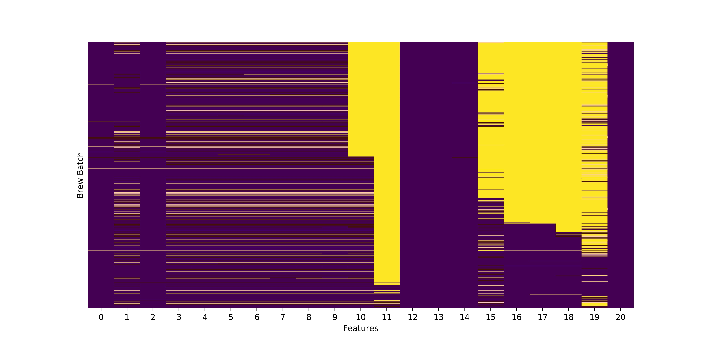
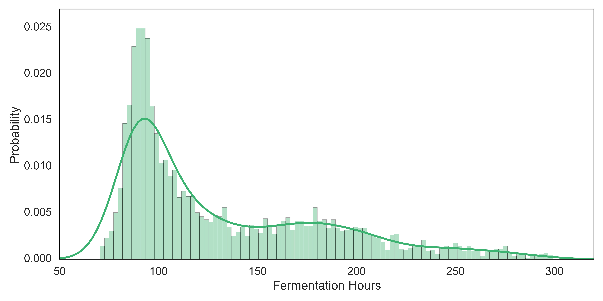
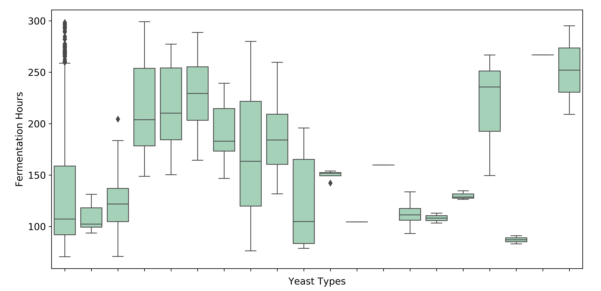
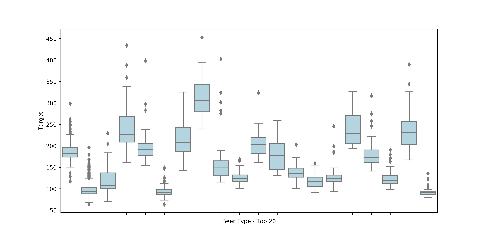
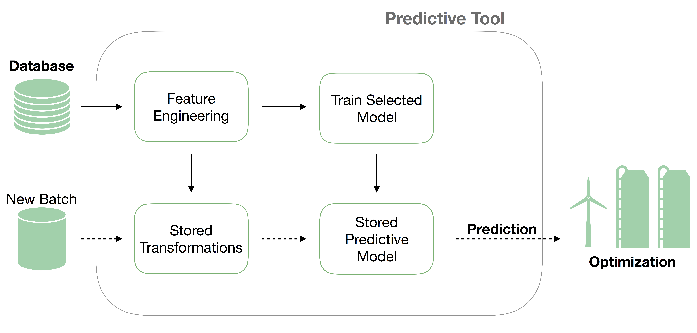

*1 - image source* 

# New Belgium Brewery - Fermentation Time Forecast

### *Objectives*
 1) Develop a prediction model that accurately forecasts fermentation time using attributes collected prior to starting the fermentation process.

 2) Create end-to-end tool for New Belgium Brewery to assist with optimizing fermentation rates for its brewing process.

### *Use Case*

>“Knowing when a beer is done fermenting in a tank allows the brewers to know when they can fill up those tanks again. When tanks are laying around empty, because the fermentation time was over estimated, New Belgium is not as efficient as they can be and are losing money. If the fermentation time in a tank is under estimated, the new batch of beer will have be wait inside of another vessel and back up the whole brewery until the the fermenter becomes available.” - Jan Van Zeghbroeck (New Belgium)

### *A Note on Confidentiality*

The data used and a subset of the results from this project are subject to a Non-Disclosure Agreement. The charts and results presented below have been modified to adhere to the NDA.
## Exploratory Data Analysis

### Part 1:  Dataset Creation

####  Feature Space

 Feature 1: Yeast Strain  
 Feature 2: Previous Hrs  
 Feature 3: Percent Viability  
 Feature 4: Harvest Date  
 Feature 5: Yeast Type  
 Feature 6: Yeast Strain  
 Feature 7: Yeast Batch'  
 Feature 8: 'From Fermentation Vessel  
 Feature 9: Previous Pitch Date  
 Feature 10: Yeast Slurry Count  
 Feature 11: Pitched Fermentation Vessel  
 Feature 12: Pitched Beer Type  
 Feature 13: Pitch Date  
 Feature 14: Target  

In order to create the prediction model, the full dataset was split into multiple sets with no missing values.

#### Figure 1: Distribution of Missing Values by Feature (full dataset)

 As *Figure 1* shows, there is a significant amount of missing values (shown in yellow). By inspecting the data, the first split can be between previously used yeast, and new yeast strains being introduced into the brewing process. New yeast strains have no data on previous batch performance. These missing values are represented on the left half of *Figure 1*. The next split can be done on the point in time when New Belgium started collected additional data points on each batch, which is represented on the right half of *Figure 1*.

### Part 2:  Exploratory Charts

#### Figure 2: Target Variable

#### Figure 3: Target by Yeast Type

#### Figure 4: Target by Beer Type (Top 20)

## Modeling

A primary objective for this project was to create a tool for New Belgium Brewery that had the ability to work with its current data recording techniques as well as provide flexibility in the predictive model.

To address this objective, the tool has the ability to switch between three different predictive models, as well as train on user defined inputs such as beer type and yeast strain.

The predictive tool follows the steps below to produce predictions:

#### Figure 5: Flowchart

### Part 1:  Data Pipeline and Preprocessing

The pipeline takes the original input format used at New Belgium and transforms the data into a useable format for the model. This pipeline includes a label encoder and one hot encoder which transform categorical variables into dummy variables. The encoding is stored so it can be used for future predictions.

### Part 2: Feature Engineering
New Belgium currently stores its fermentation vessels outside. One goal of this analysis was to determine if weather factors, such as precipitation or temperature, have an effect on fermentation rates. The model includes 8 additional weather data points sourced from Colorado State University in Fort Collins.

Also included in the dataset is a notes section used for free hand notes about each batch. The pipeline performs some basic transformations on the notes section to include in the predictive model.

### Part 3:  Available Predictive Models
The tool currently allows the use of 3 different predictive models:
 - Gradient Boosted Regressor (XGBoost)
 - Random Forest Regressor (H20)
 - Multi-layer Perceptron (Keras - Tensorflow)

The top performing model, and current default is the XGBoost, Gradient Boosted Regressor model.

### Part 4:  Creating a Baseline

In order to compare the performance of the predictive tool, a baseline was calculated using the Mean Absolute Deviation (MAD) across beer types. This metric was compared against the Mean Absolute Error (MAE) of the predictive model.

| Beer Types       | Mean          | Std |
| ------------- |:-------------:| -----:|
| Type 1     | 190 | 13 |
| Type 2     | 185    |   27 |
| Type 3| 140      |    16 |
| Type 4| 100     |    10 |

### Part 5:  Model Results
Using the XGBoost - Gradient Boosted Regressor, the predictive tool is able to make small improvements against the set baseline.

| Beer Types       | Mean          | Std | MAE | % Improvement |
| ------------- |:-------------:| -----:|-----:|-----:|
| Type 1     | 190 | 13 |11 |17% |
| Type 2     | 185     |   27 |23 |14% |
| Type 3| 140      |    16 |14 |13% |
| Type 4| 100     |    10 |7 |27%|

## Conclusion

Machine learning algorithms have the potential to improve and assist in the optimization of beer production.

The contribution of the model relies heavily on the data used to train it, however, any small improvement in the fermentation phase estimate has the potential to provide a meaningful impact to New Belgium Brewing.

As New Belgium continues to collect data and add additional features, the tool has the flexibility to adapt and improve.

##  Figure 6: Tech Stack

1 *photo source: https://grahamcruise.files.wordpress.com*
